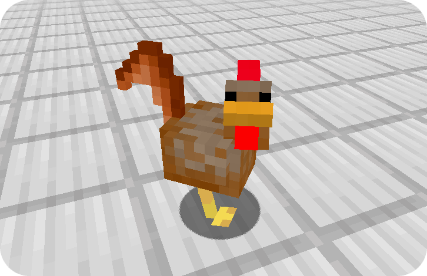

This example resource pack changes the chicken model to one of a rooster.

There are three parts to this example:
1. Create a model in `assets/minecraft/fusion/entity_models/`.
2. Create a texture for the model in `assets/minecraft/textures/entity/`.
3. Overwrite the chicken model and texture with an entity model modifier.

More information is available in the directories of the respective files.

The result will look like this:

