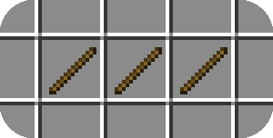

# Fusion Examples
This repository hosts a number of examples which use the various resource pack features available in Fusion.
Each folder contains a different example and each folder is a valid resource pack and can be loaded in the game.

> [!TIP]  
> If you are making a resource pack you will likely need a copy of vanilla's resources as a reference.
> To get a copy of the vanilla resources you can follow the steps [on the Vanilla Resources page on the Fusion wiki](https://github.com/SuperMartijn642/Fusion/wiki/Vanilla-Resources).

# General
### [Optional Fusion Integration](Optional%20Fusion%20Integration)
***Makes use of: overrides folder***

# Blocks
### [Connected Glass](Pieced%20Layout%20Connected%20Glass)
***Makes use of: connecting model, connecting texture with pieced layout and custom render type***  

### [Better Grass](Better%20Grass)
***Makes use of: connecting model with multiple connection predicates, connecting texture with full layout***  

### [Grass Block Overflow](Grass%20Block%20Overflow)
***Makes use of: block model modifier, connecting model, connecting texture with overlay layout and custom render type and tinting***  

### [Random Tuff Bricks Texture](Random%20Tuff%20Bricks%20Texture)
***Makes use of: base model, random texture***  

### [Large Stone Bricks Texture](Continuous%20Texture%20Large%20Stone%20Bricks)
***Makes use of: base model, continuous texture***  

### [Compact Steel Beam Texture](Compact%20Layout%20Steel%20Beam)
***Makes use of: connecting model, connecting texture with compact layout***  

### [Lapis Connecting Texture](Full%20Layout%20Lapis%20Connecting%20Texture)
***Makes use of: connecting model, connecting texture with full layout***  

### [Scrolling Conveyor Belt](Scrolling%20Texture%20Conveyor%20Belt)
***Makes use of: scrolling texture***  

### [Animated Connecting Texture](Animated%20Connecting%20Texture)
***Makes use of: connecting model, animated & connecting texture with horizontal layout***  

### [Emissive Diamond Ores](Emissive%20Diamond%20Ores)
***Makes use of: block model modifier, base model, base texture with emissiveness and custom render type***  

# Items
### [Stick Stack Size Dependent Texture](Stick%20Stack%20Size%20Dependent%20Texture)
***Makes use of: item model modifier with stack size condition***  

### [Enchanted Diamond Sword Texture](Enchanted%20Diamond%20Sword%20Texture)
***Makes use of: item model modifier with enchantment condition***  

# Entities
### [Random Creeper Textures](Random%20Creeper%20Textures)
***Makes use of: entity model modifier***  

### [Taiga Cow Texture](Taiga%20Cow%20Texture)
***Makes use of: entity model modifier with biome condition***  

### [Custom Chicken Model](Custom%20Chicken%20Model)
***Makes use of: custom entity model, entity model modifier***  

